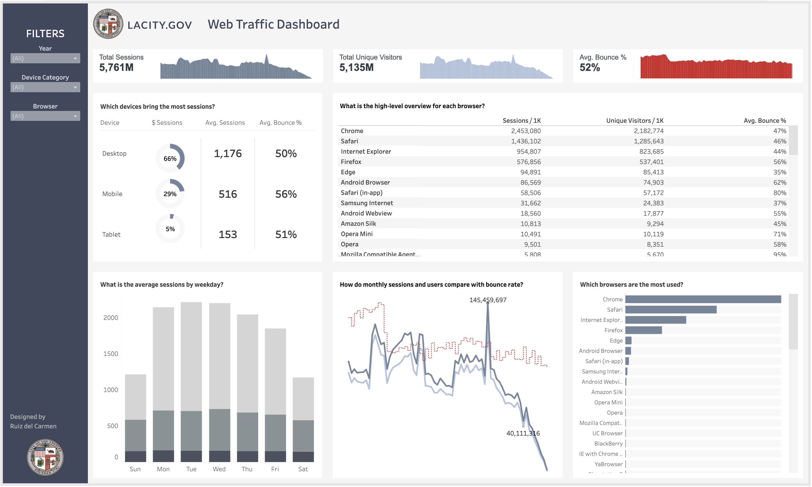

# LACity.gov Web Traffic Analysis

## Project Background

This project focuses on analyzing the web traffic data, containing over 8 million records, for lacity.gov, the official website of the City of Los Angeles, from 2014 to 2019. The goal is to provide insights into user behavior, highlight important trends, and make data-driven recommendations that can enhance user experience and web performance. The website serves as a vital resource for the residents of LA, offering information and services. Therefore, understanding the traffic patterns can help improve site engagement and ensure effective communication, especially during critical events like natural disasters.

Important terminology:

- **Sessions**: A session refers to a visit to the website, including all interactions within that visit.
- **Bounce Rate**: Percentage of sessions where users leave the site without interacting with it.
- **Device Categories**: Desktop, mobile, and tablet devices used to access the website.

## Executive Summary

The analysis is based on a dataset of 8 million records, providing insights into sessions, bounce rates, and device usage over 2014-2019. This information was visualized in a Tableau dashboard and revealed key insights into how users access the site, what devices they use, and patterns of engagement over time. The analysis shows that desktop is the dominant device for sessions, mobile has the highest bounce rate, and web traffic tends to peak during the weekdays, with notable spikes during critical events like the December 2017 wildfires. There has also been a steady decline in site traffic in the 2017-2019.

## Summary of Insights

- **Device Category Breakdown**:
    - **Desktop** brings in the most sessions (66% of the total).
    - **Mobile** ranks second but has the highest bounce rate (~6% higher than desktop).
    - **Tablets** bring in the least amount of traffic, though they have a lower bounce rate compared to mobile.
  
- **Browser Insights**:
    - On **desktop**, Chrome is the most-used browser.
    - On **mobile** and **tablet**, Safari dominates the sessions.
    - The default mobile browsers (Safari in-app and Android Browser) tend to have higher bounce rates, contributing to mobile’s higher overall bounce rate.

- **Traffic Trends**:
    - Weekdays see significantly higher traffic compared to weekends.
    - There is a notable **traffic spike in December 2017**, which correlates with multiple wildfires that occurred in California during that time. The spike suggests the website was used as a key information hub during that crisis.
    - A **steady decline in traffic from 2017 to 2019** was observed, indicating a need to investigate factors behind this trend.

## Recommendations

I would then present these findings and recommendations to the relevant teams (IT, Marketing, Web Development, etc.).

- **Crisis Communication Plan**: The spike in traffic during December 2017 highlights the importance of having an effective crisis communication strategy in place. The city should ensure that critical information can be delivered seamlessly during emergencies, especially to mobile users, who accounted for 46% of traffic during that period. Given that mobile users already have the highest bounce rate, **optimizing the mobile experience is crucial to ensure users can quickly and efficiently access urgent information without disengaging from the site**.

- **Prioritize Weekday Campaigns**: Since the website receives more traffic on weekdays, it’s recommended that marketing campaigns and critical updates be focused during the week. Web optimizations should also be scheduled for weekends when traffic is lower.
  
- **Improve Mobile Experience**: Since mobile users experience a higher bounce rate, it's crucial to enhance mobile navigation, especially the home page. Conducting UX research and testing mobile functionality will help reduce the bounce rate and improve user engagement.

- **Desktop Development Focus**: Given that desktops bring in the majority of sessions, it’s important to prioritize the performance and compatibility of the website on desktop browsers, particularly Chrome.

- **User Survey to Address Decline**: The decline in traffic over the 2017-2019 period should be investigated through user surveys. Understanding why users are visiting the site less can provide insights into areas of improvement and potential changes in the website’s functionality or content.

## Assumptions and Caveats

- The analysis assumes that the **December 2017 spike** was caused by the California wildfires, though other factors may have contributed.
- The dataset covers web traffic only up until **2019**, so any changes or trends after this period are not accounted for.
- **Bounce rate calculations** are based on the sessions data available and may not reflect changes in how users interact with specific types of content or site areas not captured in the dataset.

# Technical Project Information

The [original dataset is available here](https://www.kaggle.com/datasets/cityofLA/lacity.org-website-traffic/data). It contains data for unique visitors, total sessions, and bounce rate for lacity.org, the main website for the City of Los Angeles over the years of 2014-2019. I did some data cleaning and transformation in SQL to create the dataset used in this analysis. [You can view the SQL script here](webtraffic.sql). It was then visualized in Tableau.

Check out the [LAcity.org Web Traffic - Tableau Dashboard](https://public.tableau.com/app/profile/ruiz/viz/LAcity_orgWebTraffic/LAcity_orgWebTrafficDashboard?publish=yes).

For more about my projects and data journey, visit my [Portfolio](https://ruizdelcarmen.me/).
